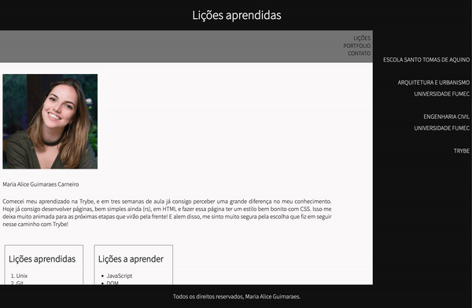

# Projeto Lições Aprendidas! <3

[Lições aprendidas](https://mariaaliceguimaraes.github.io/01%20-%20Project%20lessons%20learned/)

Criar um site que com uma série de informações a respeito do que você aprendeu nos últimos três blocos, estilizado de forma apropriada.

**Em outras palavras, uma página de `Lessons Learned`**;
