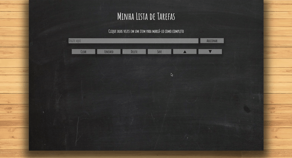

# Projeto Lista de Tarefas!

1 - Sua lista deve possuir o título "Minha Lista de Tarefas" em uma tag `<header>`. Esse título não varia de acordo com o conteúdo da lista. _Não confunda esse título com o título da página, que deve aparecer dentro da tag `head`_.

2 - Abaixo do título deve haver um pequeno e discreto parágrafo com `id="funcionamento"` e com o texto "Clique duas vezes em um item para marcá-lo como completo" explicando o funcionamento da lista para o usuário.

3 - Deve haver um `input` com o `id="texto-tarefa"` onde o usuário poderá digitar o nome do item que deseja adicionar à lista.

4 - Deve haver uma lista ordenada de tarefas com o `id="lista-tarefas"`.

5 - Deve haver um botão com `id="criar-tarefa"` e ao clicar nesse botão, um novo item deverá ser criado ao final da lista e o texto do input deve ser limpo.

6 - Os itens da lista de tarefas devem ser ordenados por ordem de criação.

7 - Ao clicar em um item da lista, altere a cor de fundo do item para cinza rgb(128,128,128).

8 - Não deve ser possível selecionar mais de um elemento da lista ao mesmo tempo.

9 - Ao clicar duas vezes em um item, ele deverá ser riscado, indicando que foi completo. Deve ser possível desfazer essa ação clicando novamente duas vezes no item.

10 - Deve haver um botão com `id="apaga-tudo"` que quando clicado deve apagar todos os items da lista.

11 - Deve haver um botão com `id="remover-finalizados"` que quando clicado remove **somente** os elementos finalizados da sua lista.

## BÔNUS

12 - Adicione um botão com `id="salvar-tarefas"` que salve o conteúdo da lista. Se você fechar e reabrir a página, a lista deve continuar no estado em que estava.

13 - Adicione dois botões, um com `id="mover-cima"` e outro com `id="mover-baixo"`, que permitam mover o item selecionado para cima ou para baixo na lista de tarefas.

14 - Adicione um botão com `id="remover-selecionado"` que, quando clicado, remove o item selecionado.

