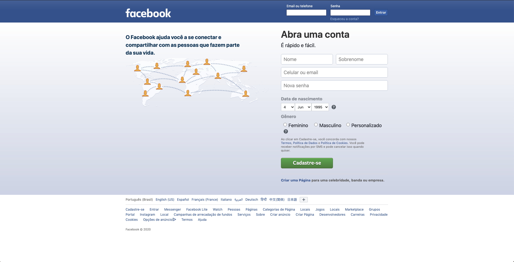

# Projeto de réplica da página de cadastro do Facebook!

### O projeto deve ser o mais parecido possível com a página inicial do Facebook. Respeitando os requisitos, tente fazer uma cópia perfeita!

Todos os requisitos tem como base a página do **Facebook**.
Use a imagem do site, além de acessar [a página de cadastro/login](https://www.facebook.com/).
Tente ser o mais fiel possível.

Use a inspeção de código para verificar a estrutura da página de cadastro/login do **Facebook**.

Você irá desenvolver este projeto em **dupla** e é fundamental que siga as instruções do repositório.

