# Projeto Cookmaster!

# Sumário

- [Habilidades](#habilidades)
- [Entregáveis](#entregáveis)
  - [O que deverá ser desenvolvido](#o-que-deverá-ser-desenvolvido)
  - [Desenvolvimento](#desenvolvimento)
  - [Data de Entrega](#data-de-entrega)
- [Instruções para entregar seu projeto](#instruções-para-entregar-seu-projeto)
  - [Antes de começar a desenvolver](#antes-de-começar-a-desenvolver)
  - [Durante o desenvolvimento](#durante-o-desenvolvimento)
  - [Depois de terminar o desenvolvimento](#depois-de-terminar-o-desenvolvimento)
- [Como desenvolver](#como-desenvolver)
  - [Todos os seus endpoints devem estar no padrão REST](#todos-os-seus-endpoints-devem-estar-no-padrão-rest)
  - [Conexão com o Banco](#conexão-com-o-banco)
  - [Coleções](#Coleções)
  - [Linter](#linter)
- [Requisitos do projeto](#requisitos-do-projeto)
  - [Lista de requisitos](#lista-de-requisitos)
    - [1 - Crie um endpoint para o cadastro de usuários](#1---crie-um-endpoint-para-o-cadastro-de-usuários)
    - [2 - Crie um endpoint para o login de usuários](#2---crie-um-endpoint-para-o-login-de-usuários)
    - [3 - Crie um endpoint para o cadastro de receitas](#3---crie-um-endpoint-para-o-cadastro-de-receitas)
    - [4 - Crie um endpoint para a listagem de receitas](#4---crie-um-endpoint-para-a-listagem-de-receitas)
    - [5 - Crie um endpoint para visualizar uma receita específica](#5---crie-um-endpoint-para-visualizar-uma-receita-específica)
    - [6 - Permissões do usuário admin](#6---permissões-do-usuário-admin)
    - [7 - Crie um endpoint para a edição de uma receita](#7---crie-um-endpoint-para-a-edição-de-uma-receita)
    - [8 - Crie um endpoint para a exclusão de uma receita](#8---crie-um-endpoint-para-a-exclusão-de-uma-receita)
    - [9 - Crie um endpoint para a adição de uma imagem a uma receita](#9---crie-um-endpoint-para-a-adição-de-uma-imagem-a-uma-receita)
    - [10 - Crie um endpoint para acessar a imagem de uma receita](#10---crie-um-endpoint-para-acessar-a-imagem-de-uma-receita)
  - [Bônus](#bônus)
    - [11 - Cadastramento de admin](#11---cadastramento-de-admin)
- [Revisando um pull request](#revisando-um-pull-request)
- [Avisos finais](#avisos-finais)

---

# Habilidades

Neste projeto, você será capaz de:

- Entender o que há por dentro de um token de autenticação;

- Gerar tokens a partir de informações como login e senha;

- Autenticar rotas do Express, usando o token JWT;

- Fazer upload de arquivos em APIs REST;

- Salvar arquivos no servidor através de uma API REST;

- Consultar arquivos do servidor através de uma api REST.

---

# Entregáveis

Para entregar o seu projeto você deverá criar um Pull Request neste repositório.

Lembre-se que você pode consultar nosso conteúdo sobre [Git & GitHub](https://app.betrybe.com/course/fundamentals/git) sempre que precisar!

---

## O que deverá ser desenvolvido

Você vai desenvolver seu app utilizando a arquitetura MSC!

Neste novo projeto deverá ser possível fazer o cadastro e login de pessoa usuária, onde apenas esse usúario poderá acessar, modificar e deletar as receitas que cadastrou.

---

# Requisitos do projeto

## Lista de requisitos

### 1 - Crie um endpoint para o cadastro de usuários

- A rota deve ser (`/users`).

- No banco um usuário precisa ter os campos Email, Senha, Nome e Role.

- Para criar um usuário através da API, todos os campos são obrigatórios, com exceção do Role.

- O campo Email deve ser único.

- Usuários criados através desse endpoint devem ter seu campo Role com o atributo _user_, ou seja, devem ser usuários comuns, e não admins.

- O body da requisição deve conter o seguinte formato:

  ```json
  {
    "name": "string",
    "email": "string",
    "password": "string"
  }
  ```

**Além disso, as seguintes verificações serão feitas:**

- **[Será validado que o campo "name" é obrigatório]**

Se o usuário não tiver o campo "name" o resultado retornado deverá ser conforme exibido abaixo, com um status http `400`:

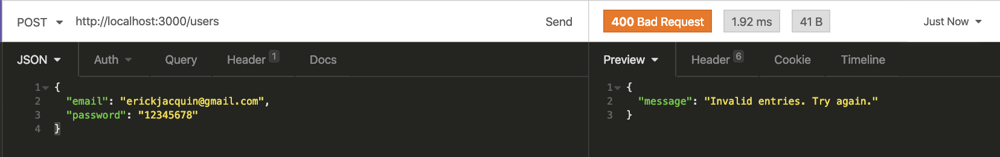

- **[Será validado que o campo "email" é obrigatório]**

Se o usuário não tiver o campo "email" o resultado retornado deverá ser conforme exibido abaixo, com um status http `400`:

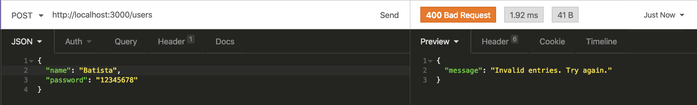

- **[Será validado que não é possível cadastrar usuário com o campo email inválido]**

Se o usuário tiver o campo email inválido o resultado retornado deverá ser conforme exibido abaixo, com um status http `400`:


- **[Será validado que o campo "senha" é obrigatório]**

Se o usuário não tiver o campo "senha" o resultado retornado deverá ser conforme exibido abaixo, com um status http `400`:


- **[Será validado que o campo "email" é único]**

Se o usuário cadastrar o campo "email" com um email que já existe, o resultado retornado deverá ser conforme exibido abaixo, com um status http `409`:

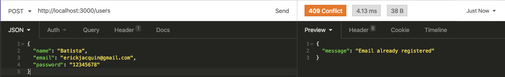

- **[Será validado que é possível cadastrar usuário com sucesso]**

Se o usuário for cadastrado com sucesso o resultado retornado deverá ser conforme exibido abaixo, com um status http `201`:

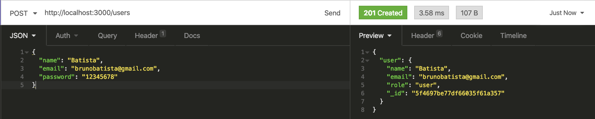

- **[Será validado que é possível ao cadastrar usuário, o valor do campo "role" tenha o valor "user"]**

Se o usuário for criado com sucesso o resultado retornado deverá ser conforme exibido abaixo, com um status http `201`:


### 2 - Crie um endpoint para o login de usuários

- A rota deve ser (`/login`).

- A rota deve receber os campos Email e Senha e esses campos devem ser validados no banco de dados.

- Na configuração do `JWT` não use variáveis de ambientes para não ter conflito com o avaliador.

- Um token `JWT` deve ser gerado e retornado caso haja sucesso no login. No seu payload deve estar presente o id, email e role do usuário.

- O body da requisição deve conter o seguinte formato:

  ```json
  {
    "email": "string",
    "password": "string"
  }
  ```

**Além disso, as seguintes verificações serão feitas:**

- **[Será validado que o campo "email" é obrigatório]**

Se o login não tiver o campo "email" o resultado retornado deverá ser conforme exibido abaixo, com um status http `401`:


- **[Será validado que o campo "password" é obrigatório]**

Se o login não tiver o campo "password" o resultado retornado deverá ser conforme exibido abaixo, com um status http `401`:

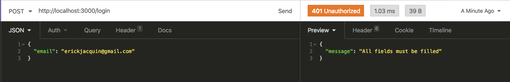

- **[Será validado que não é possível fazer login com um email inválido]**

Se o login tiver o email inválido o resultado retornado deverá ser conforme exibido abaixo, com um status http `401`:

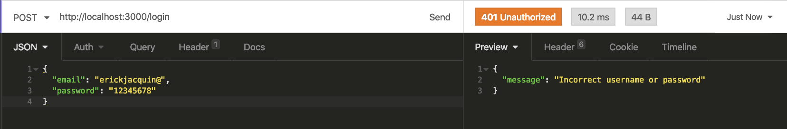

- **[Será validado que não é possível fazer login com uma senha inválida]**

Se o login tiver a senha inválida o resultado retornado deverá ser conforme exibido abaixo, com um status http `401`:

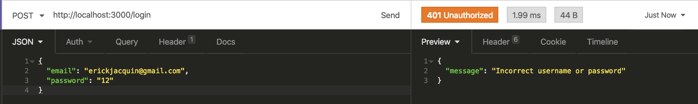

- **[Será validado que é possível fazer login com sucesso]**

Se foi feito login com sucesso o resultado retornado deverá ser conforme exibido abaixo, com um status http `200`:

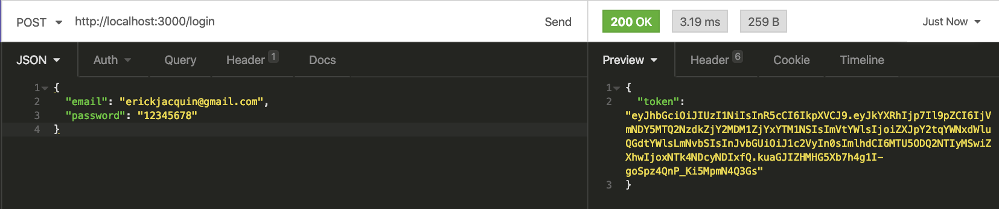

### 3 - Crie um endpoint para o cadastro de receitas

- A rota deve ser (`/recipes`).

- A receita só pode ser criada caso o usuário esteja logado e o token `JWT` validado.

- No banco, a receita deve ter os campos Nome, Ingredientes, Modo de preparo, URL da imagem e Id do Autor.

- Nome, ingredientes e modo de preparo devem ser recebidos no corpo da requisição, com o seguinte formato:

  ```json
  {
    "name": "string",
    "ingredients": "string",
    "preparation": "string"
  }
  ```

- O campo dos ingredientes pode ser um campo de texto aberto.

- O campo ID do autor, deve ser preenchido automaticamente com o ID do usuário logado, que deve ser extraído do token JWT.

- A URL da imagem será preenchida através de outro endpoint

**Além disso, as seguintes verificações serão feitas:**

- **[Será validado que não é possível cadastrar receita sem o campo "name"]**

Se a receita não tiver o campo "name" o resultado retornado deverá ser conforme exibido abaixo, com um status http `400`:


- **[Será validado que não é possível cadastrar receita sem o campo "ingredients"]**

Se a receita não tiver o campo "ingredients" o resultado retornado deverá ser conforme exibido abaixo, com um status http `400`:

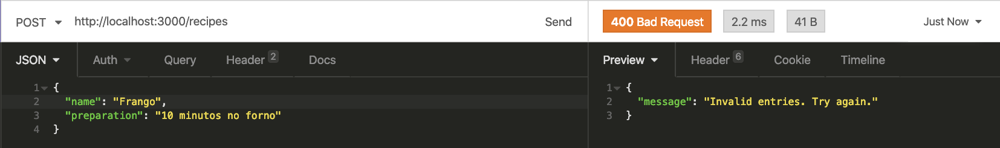

- **[Será validado que não é possível cadastrar receita sem o campo "preparation"]**

Se a receita não tiver o campo "preparation" o resultado retornado deverá ser conforme exibido abaixo, com um status http `400`:

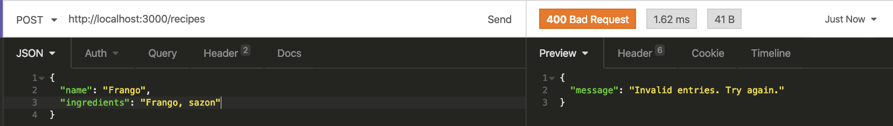

- **[Será validado que não é possível cadastrar uma receita com token invalido]**

Se a receita não tiver o token válido o resultado retornado deverá ser conforme exibido abaixo, com um status http `401`:

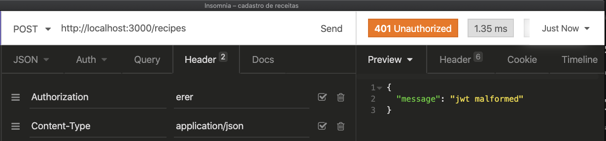

- **[Será validado que é possível cadastrar uma receita com sucesso]**

O resultado retornado para cadastrar a receita com sucesso deverá ser conforme exibido abaixo, com um status http `201`:


### 4 - Crie um endpoint para a listagem de receitas

- A rota deve ser (`/recipes`).

- A rota pode ser acessada por usuários logados ou não

**Além disso, as seguintes verificações serão feitas:**

- **[Será validado que é possível listar todas as receitas sem estar autenticado]**

O resultado retornado para listar receitas com sucesso deverá ser conforme exibido abaixo, com um status http `200`:

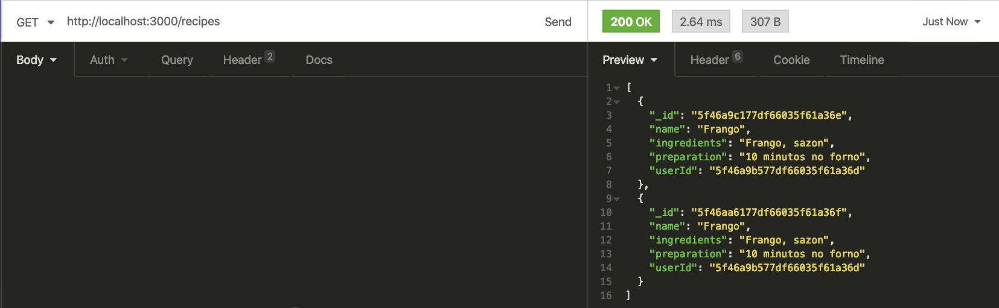

- **[Será validado que é possível listar todas as receitas estando autenticado]**

O resultado retornado para listar receitas com sucesso deverá ser conforme exibido abaixo, com um status http `200`:


### 5 - Crie um endpoint para visualizar uma receita específica

- A rota deve ser (`/recipes/:id`).

- A rota pode ser acessada por usuários logados ou não

**Além disso, as seguintes verificações serão feitas:**

- **[Será validado que é possível listar uma receita específica sem estar autenticado]**

O resultado retornado para listar uma receita com sucesso deverá ser conforme exibido abaixo, com um status http `200`:

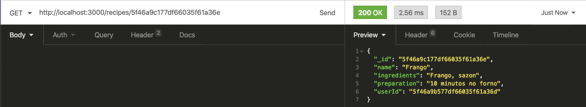

- **[Será validado que é possível listar uma receita específica estando autenticado]**

O resultado retornado para listar uma receita com sucesso deverá ser conforme exibido abaixo, com um status http `200`:


- **[Será validado que não é possível listar uma receita que não existe]**

O resultado retornado para listar uma receita que não existe deverá ser conforme exibido abaixo, com um status http `404`:


### 6 - Permissões do usuário admin

Crie um arquivo `seed.js` na raiz do projeto com uma query do Mongo DB capaz de inserir um usuário na coleção _users_ com os seguintes valores:

`{ name: 'admin', email: 'root@email.com', password: 'admin', role: 'admin' }`

**Obs.:** Esse usuário tem o poder de criar, deletar, atualizar ou remover qualquer receita, independente de quem a cadastrou. Isso será solicitado ao longo dos próximos requisitos.

**Além disso, as seguintes verificações serão feitas:**

- **[Será validado que o projeto tem um arquivo de seed, com um comando para inserir um usuário root e verifico que é possivel fazer login]**    

Será validado no arquivo `seed.js` existe a query para criar um usuário root

### 7 - Crie um endpoint para a edição de uma receita

- A rota deve ser (`/recipes/:id`).

- A receita só pode ser atualizada caso o usuário esteja logado e o token `JWT` validado.

- A receita só pode ser atualizada caso pertença ao usuário logado, ou caso esse usuário seja um admin.

- O corpo da requisição deve receber o seguinte formato:

  ```json
  {
    "name": "string",
    "ingredients": "string",
    "preparation": "string"
  }
  ```

**Além disso, as seguintes verificações serão feitas:**

- **[Será validado que não é possível editar receita sem estar autenticado]**

O resultado retornado para editar receita sem autenticação deverá ser conforme exibido abaixo, com um status http `401`:


- **[Será validado que não é possível editar receita com token inválido]**

O resultado retornado para editar receita com token inválido deverá ser conforme exibido abaixo, com um status http `401`:


- **[Será validado que é possível editar receita estando autenticado]**

O resultado retornado para editar uma receita com sucesso deverá ser conforme exibido abaixo, com um status http `200`:

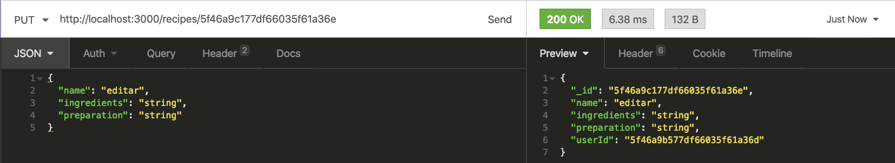

- **[Será validado que é possível editar receita com usuário admin]**

O resultado retornado para editar uma receita com sucesso deverá ser conforme exibido abaixo, com um status http `200`:


### 8 - Crie um endpoint para a exclusão de uma receita

- A rota deve ser (`/recipes/:id`).

- A receita só pode ser excluída caso o usuário esteja logado e o token `JWT` validado.

- A receita só pode ser excluída caso pertença ao usuário logado, ou caso o usuário logado seja um admin.

**Além disso, as seguintes verificações serão feitas:**

- **[Será validado que não é possível excluir receita sem estar autenticado]**

O resultado retornado para excluir uma receita sem autenticação deverá ser conforme exibido abaixo, com um status http `401`:


- **[Será validado que é possível excluir receita estando autenticado]**

O resultado retornado para excluir uma receita com sucesso deverá ser conforme exibido abaixo, com um status http `204`:

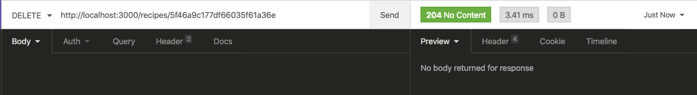

- **[Será validado que é possível excluir receita com usuário admin]**

O resultado retornado para excluir uma receita com sucesso deverá ser conforme exibido abaixo, com um status http `204`:


### 9 - Crie um endpoint para a adição de uma imagem a uma receita

- A rota deve ser (`/recipes/:id/image/`).

- A imagem deve ser lida do campo `image`.

- O endpoint deve aceitar requisições no formato `multipart/form-data`.

- A receita só pode ser atualizada caso o usuário esteja logado e o token `JWT` validado.

- A receita só pode ser atualizada caso pertença ao usuário logado ou caso o usuário logado seja admin.

- O upload da imagem deverá ser feito utilizando o `Multer`.

- O nome do arquivo deve ser o ID da receita.

- A URL completa para acessar a imagem através da API deve ser gravada no banco de dados, junto com os dados da receita.

**Além disso, as seguintes verificações serão feitas:**

- **[Será validado que é possível enviar foto com usuário autenticado]**

O resultado retornado para adicionar uma foto na receita com sucesso deverá ser conforme exibido abaixo, com um status http `200`:

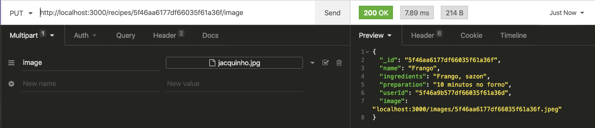

- **[Será validado que ao enviar foto, o nome da imagem é alterada para o id da receita]**

O resultado retornado para adicionar uma foto na receita com sucesso deverá ser conforme exibido abaixo, com um status http `200`:


- **[Será validado que não é possível enviar foto sem estar autenticado]**

O resultado retornado para adicionar uma foto na receita com sucesso deverá ser conforme exibido abaixo, com um status http `401`:

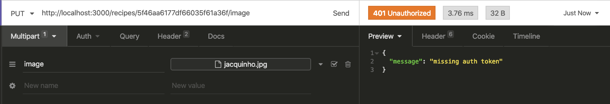

- **[Será validado que é possível enviar foto com usuário admin]**

O resultado retornado para adicionar uma foto na receita com sucesso deverá ser conforme exibido abaixo, com um status http `200`:


### 10 - Crie um endpoint para acessar a imagem de uma receita

- As imagens devem estar disponíveis através da rota `/images/<id-da-receita>.jpeg` na API.

**Além disso, as seguintes verificações serão feitas:**

- **[Será validado que é retornada uma imagem como resposta]**

O resultado retornado deverá ser do tipo imagem, com um status http `200`:

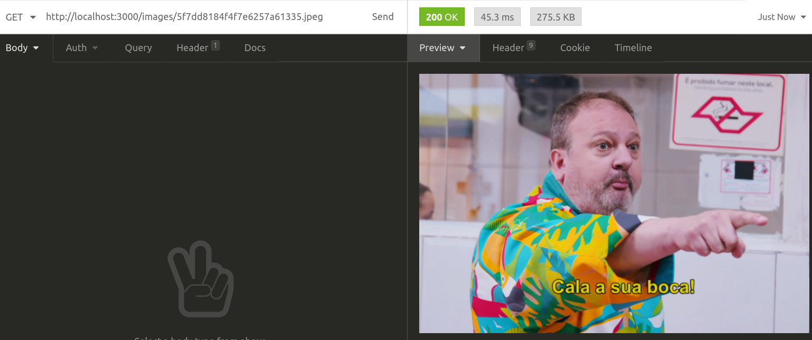


## Bônus

### 11 - Cadastramento de admin

- A rota deve ser (`/users/admin`).

- Só será possível adicionar um admin caso esta ação esteja sendo feita por outro admin, portanto, deve ser validado se há um admin logado.

- Por padrão, as requisições pra esse endpoint devem adicionar um usuário com a role _admin_.

- O corpo da requisição deve ter o seguinte formato:

  ```json
  {
    "name": "string",
    "email": "string",
    "password": "string"
  }
  ```

**Além disso, as seguintes verificações serão feitas:**

- **[Será validado que não é possível cadastrar um usuário admin, sem estar autenticado como um usuário admin]**

Se o usuário admin não é criado com sucesso o resultado retornado deverá ser conforme exibido abaixo, com um status http `403`:

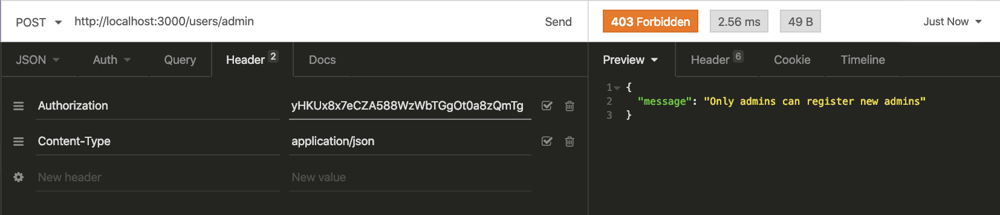

- **[Será validado que é possível cadastrar um usuário admin]**

Se o usuário admin é criado com sucesso o resultado retornado deverá ser conforme exibido abaixo, com um status http `201`:

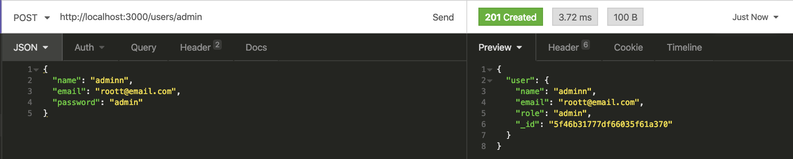

