# Projeto API de Blogs!


# Habilidades 

Nesse projeto, você vai construir um back-end usando `ORM` com o pacote `sequelize` do `npm`, e será capaz de:
 - Criar e associar tabelas usando `models` do `sequelize`
 - Construir endpoints para consumir os models que criar 
 - Fazer um `CRUD` com o `ORM`

---

# Requisitos do projeto:

## Antes de começar
### ⚠️ Leia-os atentamente e siga à risca o que for pedido. ⚠️

### 👀 Observações importantes:

O não cumprimento de um requisito, total ou parcialmente, impactará em sua avaliação.

Há um arquivo `index.js` no repositório. Não remova, nele, o seguinte trecho de código:

```javascript
app.get('/', (request, response) => {
  response.send();
});
```

**Você irá precisar configurar as variáveis globais do MySQL.** Você pode usar esse [Conteúdo de variáveis de ambiente com NodeJS](https://blog.rocketseat.com.br/variaveis-ambiente-nodejs/) como referência.

**Faça essas configurações também para as variáveis de ambiente usadas nesses arquivo:**

`sd-06-project-blogs-api-rubric/config/config.js`

```
module.exports = {
  "development": {
    "username": process.env.MYSQL_USER,
    "password": process.env.MYSQL_PASSWORD, 
    "database": 'blogs_api', 
    "host": process.env.HOSTNAME,
    "dialect": 'mysql',
  },
  "test": {
    "username": process.env.MYSQL_USER,
    "password": process.env.MYSQL_PASSWORD,
    "database": 'blogs_api',
    "host": process.env.HOSTNAME,
    "dialect": "mysql",
  },
  "production": {
    "username": process.env.MYSQL_USER,
    "password": process.env.MYSQL_PASSWORD,
    "database": 'blogs_api',
    "host": process.env.HOSTNAME,
    "dialect": 'mysql',
  },
};
```

**(Neste arquivo e obrigatório deixar o nome do database como `"database": 'blogs_api'`)**

**É essencial usar essas 3 variávies no arquivo acima:**

#### Variáveis:

`host: process.env.HOSTNAME`

`user: process.env.MYSQL_USER`

`password: process.env.MYSQL_PASSWORD`

**Com elas que iremos conseguir conectar ao banco do avaliador automático**

### Dicas

#### Status HTTP

Tenha em mente que todas as "respostas" devem respeitar os [status do protocolo HTTP](https://developer.mozilla.org/pt-BR/docs/Web/HTTP/Status) com base no que o REST prega.

Alguns exemplos:

  - Requisições que precisam de token mas não o receberam devem retornar um código de `status 401`;

  - Requisições que não seguem o formato pedido pelo servidor devem retornar um código de `status 400`;

  - Um problema inesperado no servidor deve retornar um código de `status 500`;

  - Um acesso ao criar um recurso, no nosso caso usuário ou post, deve retornar um código de `status 201`.

---

#### Os seguintes pontos serão avaliados:

- O seu projeto deverá usar um `ORM` para criar e atualizar o seu banco. A clonagem do projeto seguida de um comando de migrate deve deixá-lo em sua forma esperada.

- Deve conter uma tabela chamada **Users**, contendo os seguinte dados:

  ```json
  {
    "id": "401465483996",
    "displayName": "Brett Wiltshire",
    "email": "brett@email.com", // tem quer ser único
    "password": "123456",
    "image": "http://4.bp.blogspot.com/_YA50adQ-7vQ/S1gfR_6ufpI/AAAAAAAAAAk/1ErJGgRWZDg/S45/brett.png"
  }
  ```

- Deve conter uma tabela chamada **BlogPosts**, contendo os seguinte dados:

  ```json
  {
    "id": "7706273476706534553",
    "title": "Latest updates, August 1st",
    "content": "The whole text for the blog post goes here in this key",
    "user_id": "401465483996", // esse é o id que referência usuário que é o autor do post
    "published": "2011-08-01T19:58:00.000Z",
    "updated": "2011-08-01T19:58:51.947Z",
  }
  ```

  **OBS: Os testes irão rodar atráves do seu migrate usando os seguintes comandos:**

  "drop": "npx sequelize-cli db:drop $" -- Dropa o banco

  "prestart": "npx sequelize-cli db:create && npx sequelize-cli db:migrate $" -- Cria o banco e gera as tabelas

  "seed": "npx sequelize-cli db:seed:all $", -- Insere dados na tabela

  **Então preste bastante atenção se estiver errado o avaliador não irá funcionar**

  **Haverá um arquivo na pasta `/seeders` dentro dela irá conter as querys para inserir no banco `não remova ela o avaliador irá usar ela`.

## Lista de Requisitos:

### 1 - Sua aplicação deve ter o endpoint POST `/user`

#### Os seguintes pontos serão avaliados:

- O endpoint deve ser capaz de adicionar um novo user a sua tabela no banco de dados;

- O corpo da requisição deverá ter o seguinte formato:

  ```json
  {
    "displayName": "Brett Wiltshire",
    "email": "brett@email.com",
    "password": 123456,
    "image": "http://4.bp.blogspot.com/_YA50adQ-7vQ/S1gfR_6ufpI/AAAAAAAAAAk/1ErJGgRWZDg/S45/brett.png"
  }
  ```
- O campo `displayName` deverá ser uma string com no mínimo de 8 caracteres;

- O campo `email` será considerado válido se tiver o formato `<prefixo>@<domínio>` e se for único. Ele é obrigatório.

- A senha deverá conter 6 caracteres. Ela é obrigatória.

- Caso exista uma pessoa com o mesmo email na base, deve-se retornar o seguinte erro:

  ```json
  {
    "message": "Usuário já existe"
  }
  ```

- Caso contrário, retornar a mesma resposta do endpoint de `/login`, um token `JWT`:

  ```json
  {
    "token": "token-aqui"
  }
  ```

### Além disso, as seguintes verificações serão feitas:

**[Será validado que é possível cadastrar um usuário com sucesso]**

Se o usuário for criado com sucesso o resultado retornado deverá ser conforme exibido abaixo, com um status http `201`:

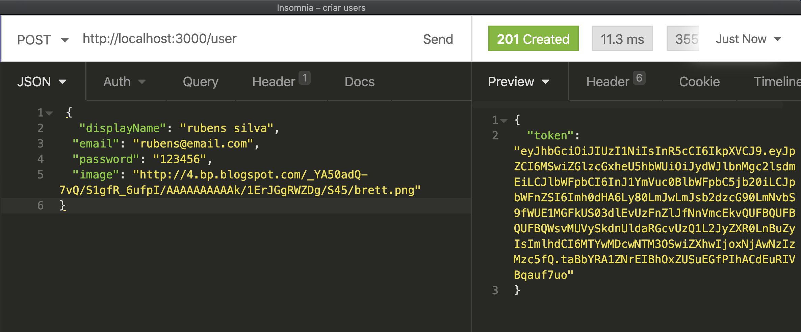

**[Será validado que não é possível cadastrar usuário com o campo `displayName` menor que 8 caracteres]**

Se o usuário tiver o campo "displayName" menor que 8 caracteres o resultado retornado deverá ser conforme exibido abaixo, com um status http `400`:

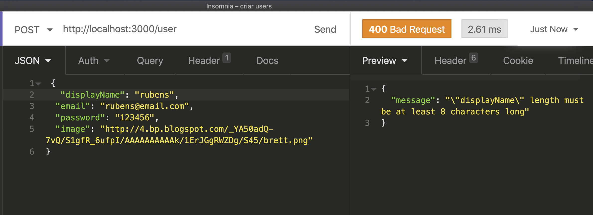
(As contrabarras `\` estão escapando as aspas de dentro da string)

**[Será validado que não é possível cadastrar usuário com o campo `email` com formato `email: rubinho`]**

Se o usuário tiver o campo "email" com o formato `email: rubinho` o resultado retornado deverá ser conforme exibido abaixo, com um status http `400`:

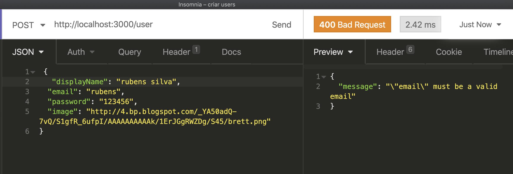
(As contrabarras `\` estão escapando as aspas de dentro da string)

**[Será validado que não é possível cadastrar usuário com o campo `email` com formato `email: @gmail.com`]**

Se o usuário tiver o campo "email" com o formato `email: @gmail.com` o resultado retornado deverá ser conforme exibido abaixo, com um status http `400`:

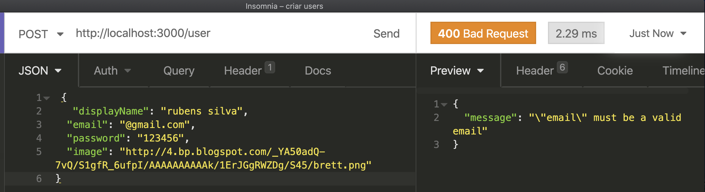
(As contrabarras `\` estão escapando as aspas de dentro da string)

**[Será validado que o campo `email` é obrigatório]**

Se o usuário não tiver campo "email" o resultado retornado deverá ser conforme exibido abaixo, com um status http `400`:

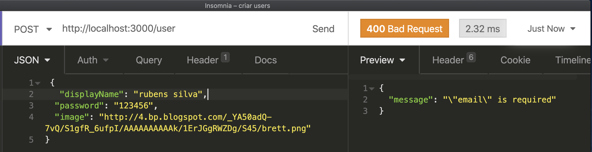
(As contrabarras `\` estão escapando as aspas de dentro da string)

**[Será validado que não é possível cadastrar usuário com o campo `password` menor que 6 caracteres]**

Se o usuário tiver o campo "password" menor que 6 caracteres o resultado retornado deverá ser conforme exibido abaixo, com um status http `400`:

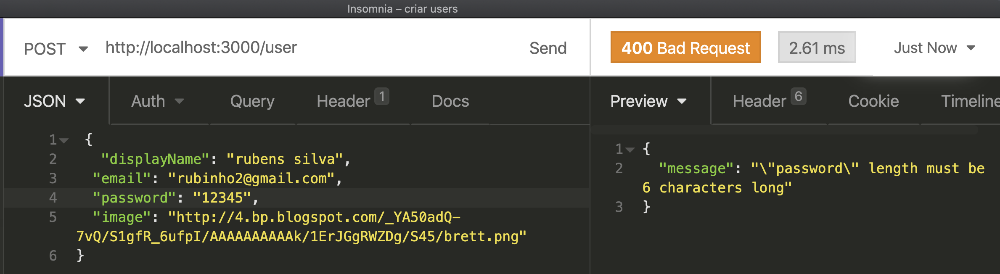
(As contrabarras `\` estão escapando as aspas de dentro da string)

**[Será validado que o campo `password` é obrigatório]**

Se o usuário não tiver campo "password" o resultado retornado deverá ser conforme exibido abaixo, com um status http `400`:

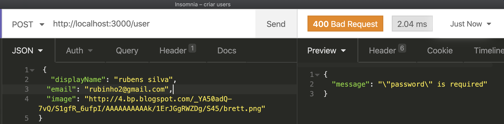
(As contrabarras `\` estão escapando as aspas de dentro da string)

**[Validar que não é possível cadastrar um usuário com email já existente]**

Se o usuário cadastrar o campo "email" com um email que já existe, o resultado retornado deverá ser conforme exibido abaixo, com um status http `409`:

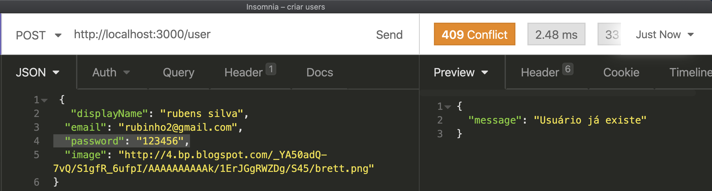

### 2 - Sua aplicação deve ter o endpoint POST `/login`

#### Os seguintes pontos serão avaliados:

- O corpo da requisição deverá seguir o formato abaixo:

  ```json
  {
    "email": "email@mail.com",
    "password": "123456"
  }
  ```

- Caso algum desses campos seja inválido ou não exista um usuário correspondente no banco de dados, retorne um código de status 400 com o corpo `{ message: "Campos inválidos" }`.

- Caso esteja tudo certo com o login, a resposta deve ser um token `JWT`, no seguinte formato:

  ```json
  {
    "token": "token-aqui"
  }
  ```

### Além disso, as seguintes verificações serão feitas:

**[Será validado que é possível fazer login com sucesso]**

Se o login foi feito com sucesso o resultado retornado deverá ser conforme exibido abaixo, com um status http `200`:

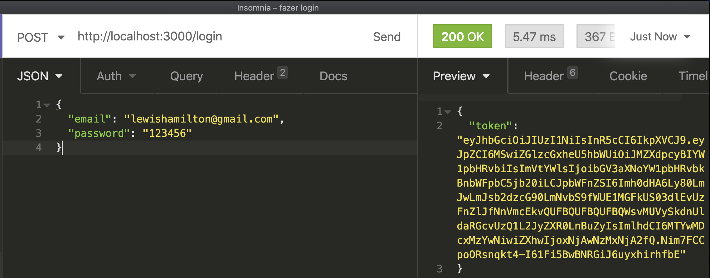

**[Será validado que não é possível fazer login sem o campo `email`]**

Se o login não tiver o campo "email" o resultado retornado deverá ser conforme exibido abaixo, com um status http `400`:

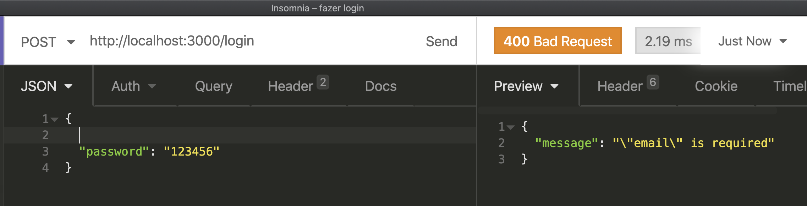
(As contrabarras `\` estão escapando as aspas de dentro da string)

**[Será validado que não é possível fazer login sem o campo `password`]**

Se o login não tiver o campo "password" o resultado retornado deverá ser conforme exibido abaixo, com um status http `400`:

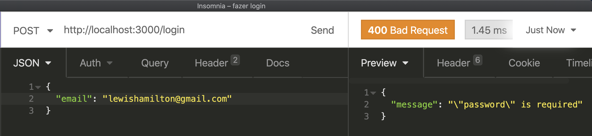
(As contrabarras `\` estão escapando as aspas de dentro da string)

**[Será validado que não é possível fazer login com o campo `email` em branco]**

Se o login tiver o campo "email" em branco o resultado retornado deverá ser conforme exibido abaixo, com um status http `400`:

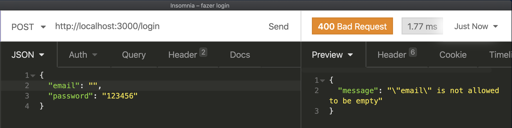
(As contrabarras `\` estão escapando as aspas de dentro da string)

**[Será validado que não é possível fazer login com o campo `password` em branco]**

Se o login tiver o campo "password" em branco o resultado retornado deverá ser conforme exibido abaixo, com um status http `400`:

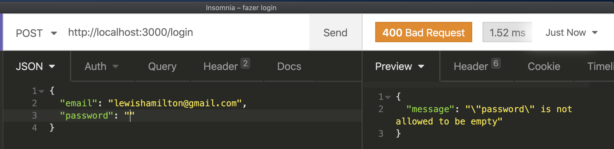
(As contrabarras `\` estão escapando as aspas de dentro da string)

**[Será validado que não é possível fazer login com um usuário que não existe]**

Se o login for com usuário inexistente o resultado retornado deverá ser conforme exibido abaixo, com um status http `400`:

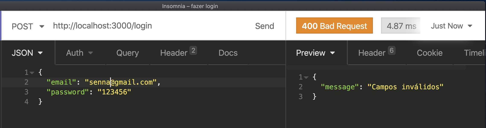

### 3 - Sua aplicação deve ter o endpoint GET `/user`

#### Os seguintes pontos serão avaliados:

- Deve listar todos os **Users** e retorná-los na seguinte estrutura:

  ```json
  [
    {
      "id": "401465483996",
      "displayName": "Brett Wiltshire",
      "email": "brett@email.com",
      "image": "http://4.bp.blogspot.com/_YA50adQ-7vQ/S1gfR_6ufpI/AAAAAAAAAAk/1ErJGgRWZDg/S45/brett.png"
    }
  ]
  ```

- A requisição deve ter token de autenticação nos headers e, caso contrário, retorne um código de `status 401`.

### Além disso, as seguintes verificações serão feitas:

**[Será validado que é possível listar todos os usuários]**

Ao listar usuários com sucesso o resultado retornado deverá ser conforme exibido abaixo, com um status http `200`:

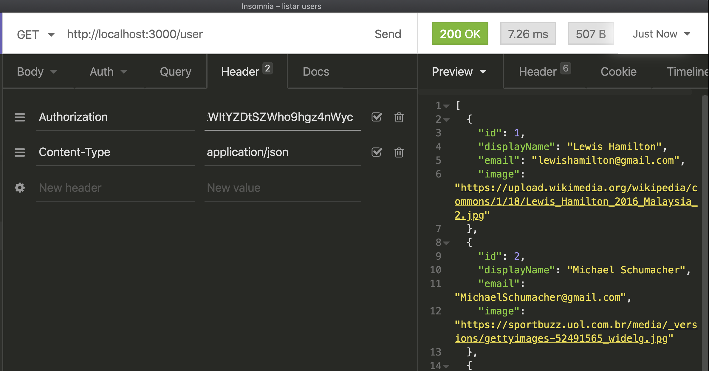

**[Será validado que não é possível listar usuários sem o token na requisição]**

Se o token for inexistente o resultado retornado deverá ser conforme exibido abaixo, com um status http `401`:

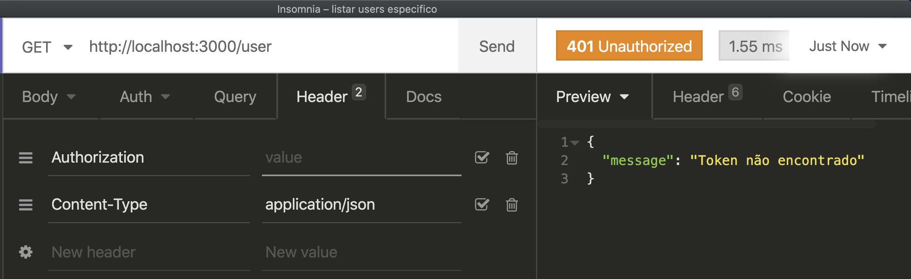

**[Será validado que não é possível listar usuários com o token inválido]**

Se o token for inválido o resultado retornado deverá ser conforme exibido abaixo, com um status http `401`:

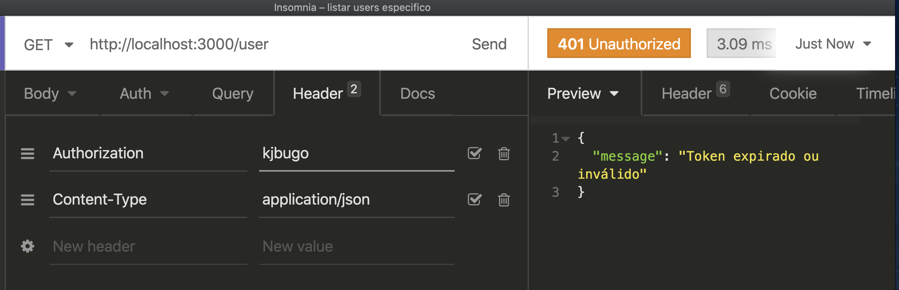

### 4 - Sua aplicação deve ter o endpoint GET `/user/:id`

#### Os seguintes pontos serão avaliados:

- Retorna os detalhes do usuário baseado no `id` da rota. Os dados devem ter o seguinte formato:

  ```json
  {
    "id": "401465483996",
    "displayName": "Brett Wiltshire",
    "email": "brett@email.com",
    "image": "http://4.bp.blogspot.com/_YA50adQ-7vQ/S1gfR_6ufpI/AAAAAAAAAAk/1ErJGgRWZDg/S45/brett.png"
  }
  ```

- A requisição deve ter token de autenticação nos headers e, caso contrário, retorne um código de `status 401`.

### Além disso, as seguintes verificações serão feitas:

**[Será validado que é possível listar um usuario específico com sucesso]**

Ao listar um usuário com sucesso o resultado retornado deverá ser conforme exibido abaixo, com um status http `200`:

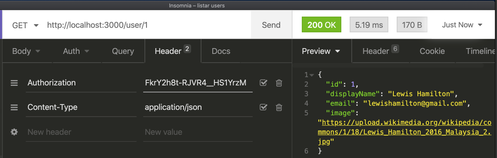

**[Será validado que não é possível listar um usuário inexistente]**

Se o usuário for inexistente o resultado retornado deverá ser conforme exibido abaixo, com um status http `404`:

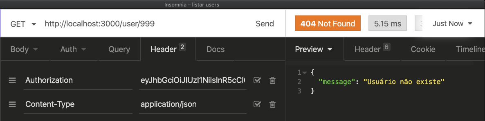

**[Será validado que não é possível listar um determinado usuário sem o token na requisição]**

Se o token for inexistente o resultado retornado deverá ser conforme exibido abaixo, com um status http `401`:

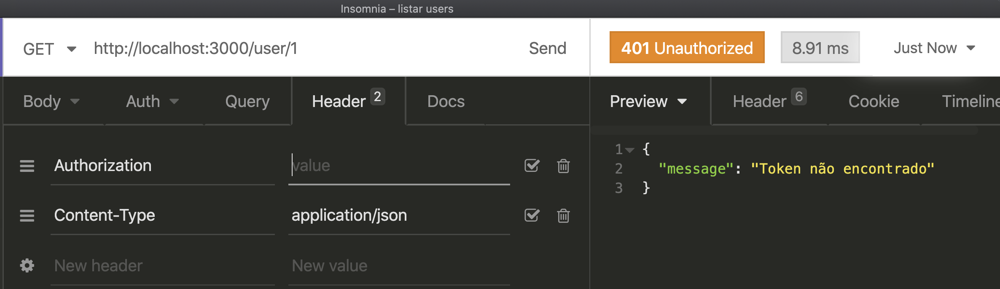

**[Será validado que não é possível listar um determinado usuário com o token inválido]**

Se o token for inválido o resultado retornado deverá ser conforme exibido abaixo, com um status http `401`:

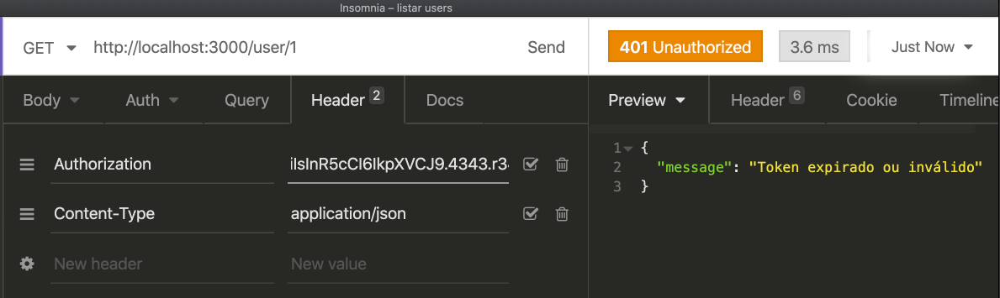

### 5 - Sua aplicação deve ter o endpoint DELETE `/user/me`

#### Os seguintes pontos serão avaliados:

- Utilizando o token de autenticação nos headers, o usuário correspondente deve ser apagado.

### Além disso, as seguintes verificações serão feitas:

**[Será validado que é possível excluir meu usuário com sucesso]**

Ao deletar um usuário com sucesso o resultado retornado deverá ser conforme exibido abaixo, com um status http `204`:

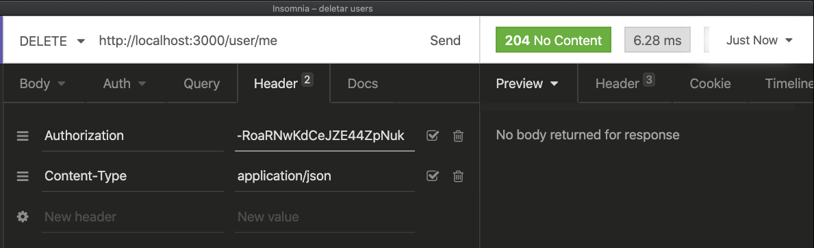

**[Será validado que não é possivel excluir meu usuário com token inválido]**

Se o token for inválido o resultado retornado deverá ser conforme exibido abaixo, com um status http `401`:

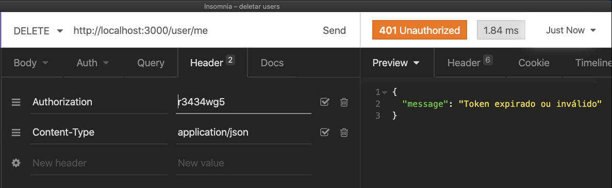

**[Será validado que não é possivel excluir meu usuário sem o token]**

Se não conter o token o resultado retornado deverá ser conforme exibido abaixo, com um status http `401`:

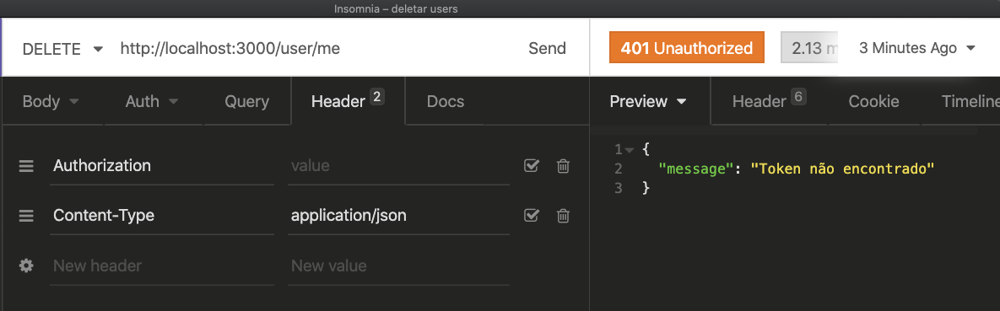

### 6 - Sua aplicação deve ter o endpoint POST `/post`

#### Os seguintes pontos serão avaliados:

- Esse endpoint deve receber um _BlogPost_ no corpo da requisição e criá-lo no banco. O corpo da requisição deve ter a seguinte estrutura:

  ```json
  {
    "title": "Latest updates, August 1st",
    "content": "The whole text for the blog post goes here in this key"
  }
  ```

- Caso o post não contenha o `title` e/ou o `content` a API deve retornar um erro de `status 400`.

- A requisição deve ter o token de autenticação nos headers e, caso contrário, retorne um código de `status 401`.

### Além disso, as seguintes verificações serão feitas:

**[Será validado que é possível cadastrar um blogpost com sucesso]**

Se cadastrar um blogpost com sucesso o resultado retornado deverá ser conforme exibido abaixo, com um status http `201`:

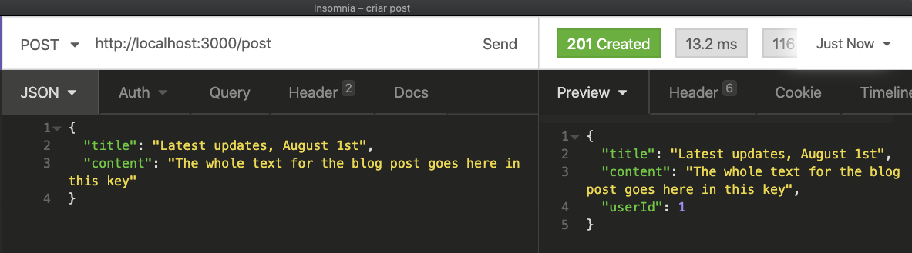

**[Será validado que não é possível cadastrar um blogpost sem o campo `title`]**

Se não conter o campo `title` o resultado retornado deverá ser conforme exibido abaixo, com um status http `400`:

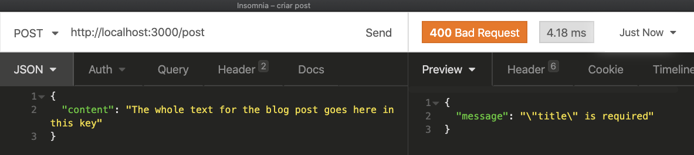

**[Será validado que não é possível cadastrar um blogpost sem o campo `content`]**

Se não conter o campo `content` o resultado retornado deverá ser conforme exibido abaixo, com um status http `400`:

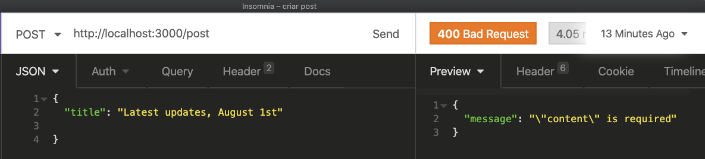

**[Será validado que não é possível cadastrar um blogpost sem o token]**

Se não conter o token o resultado retornado deverá ser conforme exibido abaixo, com um status http `401`:

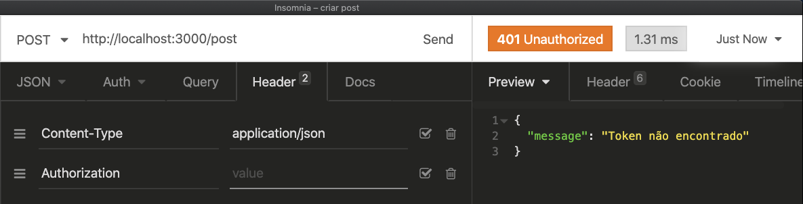

**[Será validado que não é possível cadastrar um blogpost com o token inválido]**

Se o token for inválido o resultado retornado deverá ser conforme exibido abaixo, com um status http `401`:

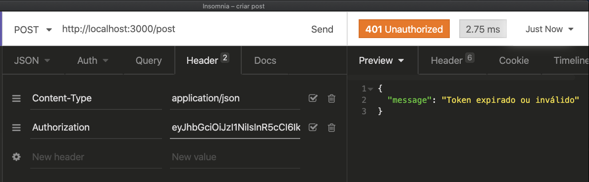

### 7 - Sua aplicação deve ter o endpoint GET `/post`

#### Os seguintes pontos serão avaliados:

- Esse endpoint deve listar todos os _BlogPosts_ e retorná-los na seguinte estrutura:

  ```json
  [
    {
      "id": "7706273476706534553",
      "published": "2011-08-01T19:58:00.000Z",
      "updated": "2011-08-01T19:58:51.947Z",
      "title": "Latest updates, August 1st",
      "content": "The whole text for the blog post goes here in this key",
      "user": { // esse usuário é o autor do post
        "id": "401465483996",
        "displayName": "Brett Wiltshire",
        "email": "brett@email.com",
        "image": "http://4.bp.blogspot.com/_YA50adQ-7vQ/S1gfR_6ufpI/AAAAAAAAAAk/1ErJGgRWZDg/S45/brett.png"
      }
    }
  ]
  ```

### Além disso, as seguintes verificações serão feitas:

**[Será validado que é possível listar blogpost com sucesso]**

Se listar os blogpost com sucesso o resultado retornado deverá ser conforme exibido abaixo, com um status http `200`:

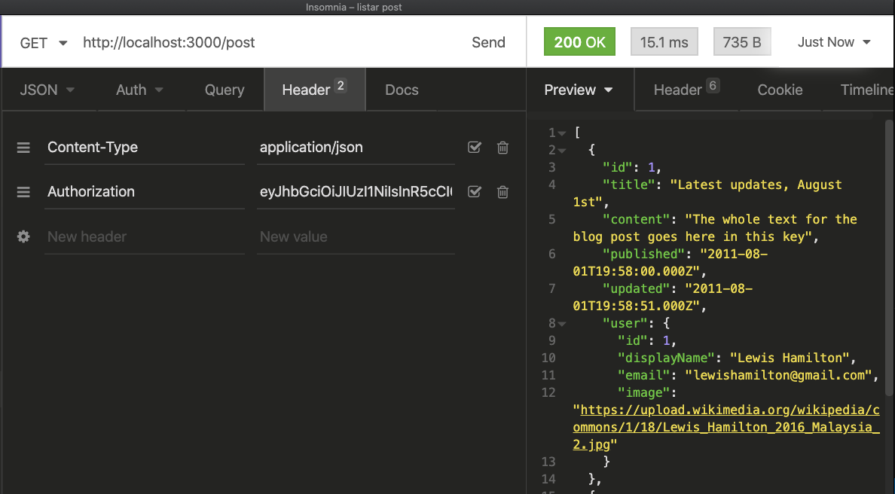

**[Será validado que não é possível listar blogpost sem token]**

Se não conter o token o resultado retornado deverá ser conforme exibido abaixo, com um status http `401`:


**[Será validado que não é possível listar blogpost com token inválido]**

Se o token for inválido o resultado retornado deverá ser conforme exibido abaixo, com um status http `401`:

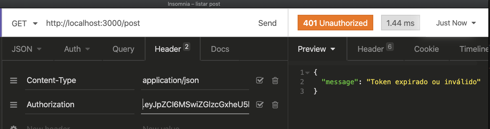

### 8 - Sua aplicação deve ter o endpoint GET `post/:id`

#### Os seguintes pontos serão avaliados:

- Retorna um **BlogPost** com o `id` especificado. O retorno deve ter os seguinte formato:

  ```json
  {
    "id": "7706273476706534553",
    "published": "2011-08-01T19:58:00.000Z",
    "updated": "2011-08-01T19:58:51.947Z",
    "title": "Latest updates, August 1st",
    "content": "The whole text for the blog post goes here in this key",
    "user": { // esse usuário é o autor do post
      "id": "401465483996",
      "displayName": "Brett Wiltshire",
      "email": "brett@email.com",
      "image": "http://4.bp.blogspot.com/_YA50adQ-7vQ/S1gfR_6ufpI/AAAAAAAAAAk/1ErJGgRWZDg/S45/brett.png",
    }
  }
  ```

### Além disso, as seguintes verificações serão feitas:

**[Será validado que é possível listar um blogpost com sucesso]**

Se listar um blogpost com sucesso o resultado retornado deverá ser conforme exibido abaixo, com um status http `200`:

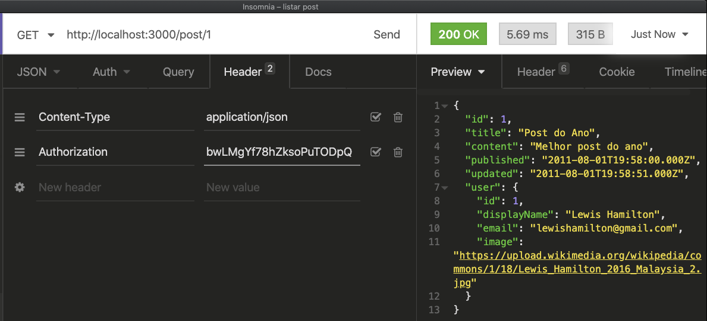

**[Será validado que não é possível listar um blogpost sem token]**

Se não conter o token o resultado retornado deverá ser conforme exibido abaixo, com um status http `401`:

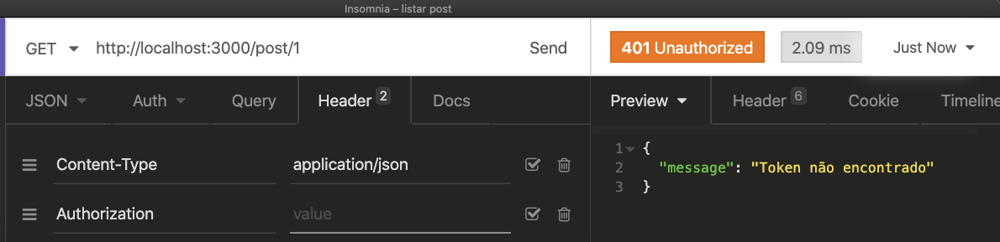

**[Será validado que não é possível listar um blogpost com token inválido]**

Se o token for inválido o resultado retornado deverá ser conforme exibido abaixo, com um status http `401`:

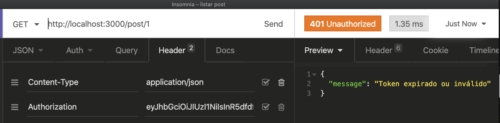

**[Será validado que não é possível listar um blogpost inexistente]**

Se o id do post for inválido o resultado retornado deverá ser conforme exibido abaixo, com um status http `404`:

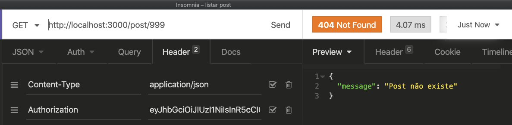

### 9 - Sua aplicação deve ter o endpoint PUT `/post/:id`

#### Os seguintes pontos serão avaliados:

- O endpoint deve receber um **BlogPost** que irá sobrescrever o original com o `id` especificado na URL. Só deve ser permitido para o usuário que criou o **BlogPost**.

- O corpo da requisição deve ter a seguinte estrutura:

  ```json
  {
    "title": "Latest updates, August 1st",
    "content": "The whole text for the blog post goes here in this key"
  }
  ```

- Caso uma pessoa diferente de quem criou faça a requisição, deve retornar um código `status 401`.

- Caso uma requisição sem token seja recebida, deve-se retornar um código de `status 401`.

- Caso o post não contenha o `title` e/ou o `content` a API deve retornar um erro de `status 400`.

### Além disso, as seguintes verificações serão feitas:

**[Será validado que é possível editar um blogpost com sucesso]**

Se editar um blogpost com sucesso o resultado retornado deverá ser conforme exibido abaixo, com um status http `200`:

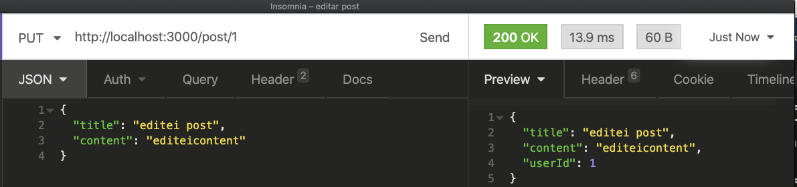

**[Será validado que não é possível editar um blogpost com outro usuário]**

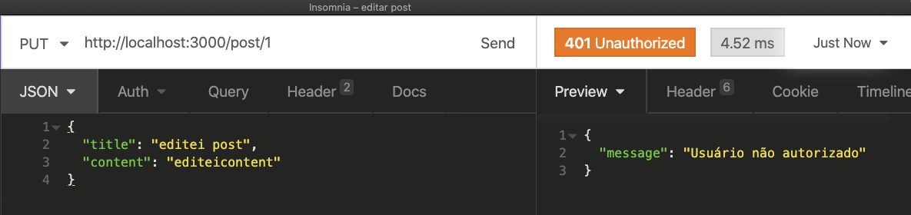

**[Será validado que não possível editar um blogpost sem token]**

Se não conter o token o resultado retornado deverá ser conforme exibido abaixo, com um status http `401`:

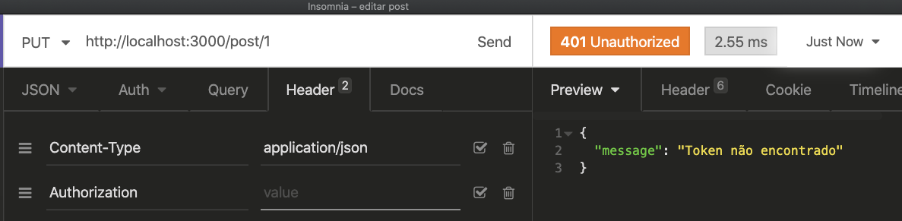

**[Será validado que não possível editar um blogpost com token inválido]**

Se o token for inválido o resultado retornado deverá ser conforme exibido abaixo, com um status http `401`:

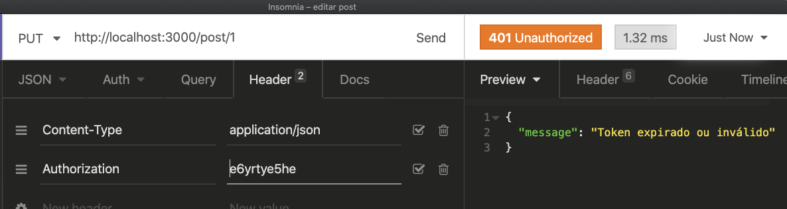

**[Será validado que não possível editar um blogpost sem o campo `title`]**

Se não conter o campo `title` o resultado retornado deverá ser conforme exibido abaixo, com um status http `400`:

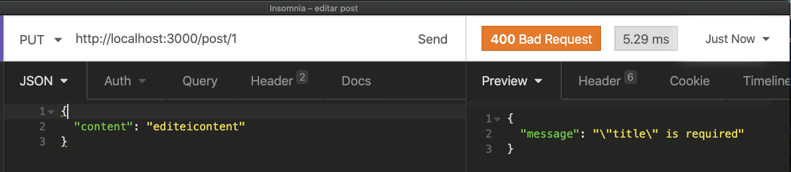

**[Será validado que não possível editar um blogpost sem o campo `content`]**

Se não conter o campo `content` o resultado retornado deverá ser conforme exibido abaixo, com um status http `400`:

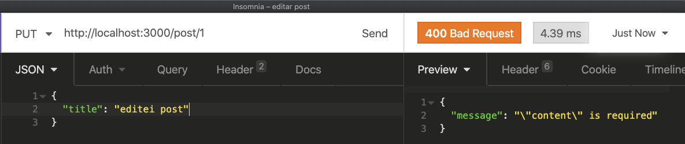

### 10 - Sua aplicação deve ter o endpoint GET `post/search?q=:searchTerm`

#### Os seguintes pontos serão avaliados:

- Retorna uma array de **BlogPosts** que contenham em seu título, ou conteúdo, o termo pesquisado no `queryParam` da URL. O retorno deve ter o seguinte formato:

  ```json
  [
    {
      "id": "7706273476706534553",
      "published": "2011-08-01T19:58:00.000Z",
      "updated": "2011-08-01T19:58:51.947Z",
      "title": "Latest updates, August 1st",
      "content": "The whole text for the blog post goes here in this key",
      "user": { // esse usuário é o autor do post
        "id": "401465483996",
        "displayName": "Brett Wiltshire",
        "email": "brett@email.com",
        "image": "http://4.bp.blogspot.com/_YA50adQ-7vQ/S1gfR_6ufpI/AAAAAAAAAAk/1ErJGgRWZDg/S45/brett.png"
      }
    }
  ]
  ```

- Caso nenhum **BlogPost** satisfaça a busca, retorne um array vazio.

### Além disso, as seguintes verificações serão feitas:

**[Será validado que é possível buscar um blogpost pelo `title`]**

Se a buscar for pelo `title` o resultado retornado deverá ser conforme exibido abaixo, com um status http `200`:


**[Será validado que é possível buscar um blogpost pelo `content`]**

Se a buscar for pelo `content` o resultado retornado deverá ser conforme exibido abaixo, com um status http `200`:

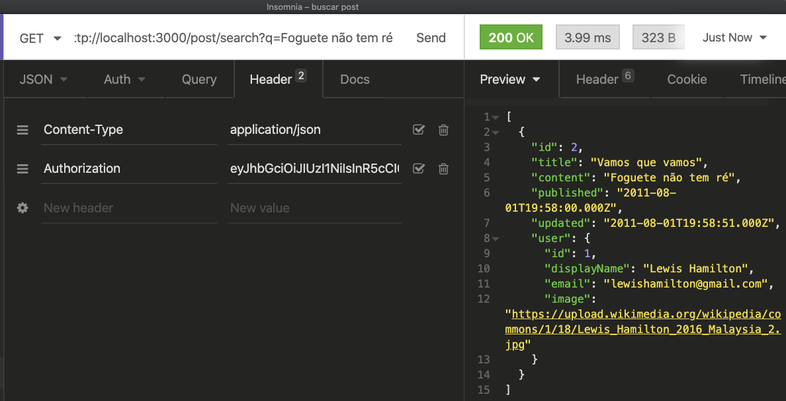

**[Será validado que é possível buscar todos os blogpost quando passa a busca vazia']**

Se a buscar for vazia o resultado retornado deverá ser conforme exibido abaixo, com um status http `200`:

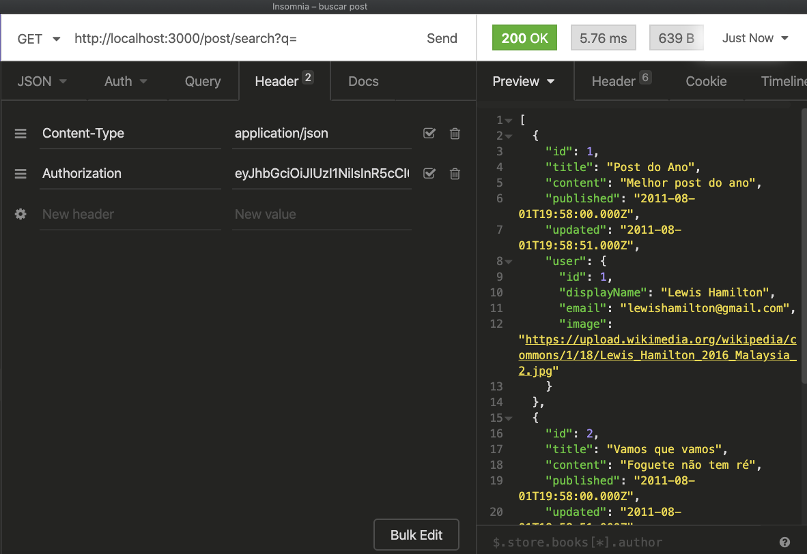

**[Será validado que é possível buscar um blogpost inexistente e retornar array vazio]**

Se a buscar um post inexistente o resultado retornado deverá ser conforme exibido abaixo, com um status http `200`:

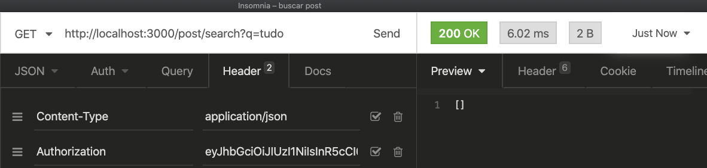

**[Será validado que não é possível buscar um blogpost sem o token]**

Se não contém o token o resultado retornado deverá ser conforme exibido abaixo, com um status http `401`:

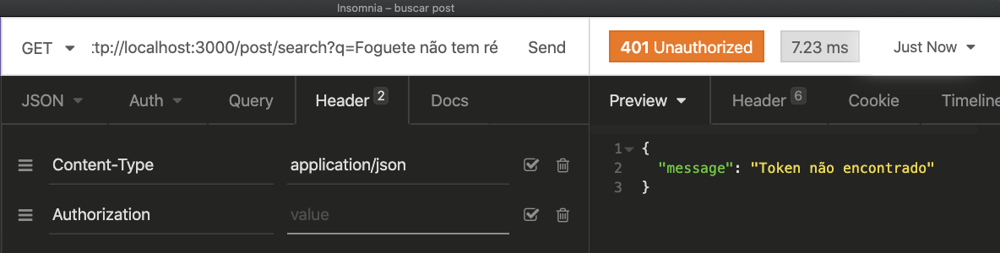

**[Será validado que não é possível buscar um blogpost com o token inválido]**

Se o token for inválido o resultado retornado deverá ser conforme exibido abaixo, com um status http `401`:

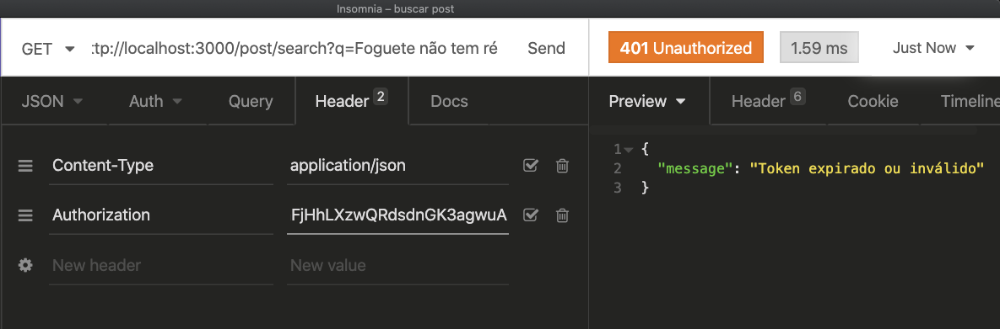

### 11 - Sua aplicação deve ter o endpoint DELETE `post/:id`

#### Os seguintes pontos serão avaliados:

- Deleta o post com o `id` especificado. Só deve ser permitido para o usuário que criou o **BlogPost**.

- Caso uma pessoa diferente de quem criou faça a requisição, deve retornar um código `status 401`.

- Caso uma requisição sem token seja recebida, deve-se retornar um código de `status 401`.

- Caso o post referido não exista, deve-se retornar um código de `status 404`.

### Além disso, as seguintes verificações serão feitas:

**[Será validado que é possível deletar um blogpost com sucesso]**

Se deletar blogpost com sucesso o resultado retornado deverá ser conforme exibido abaixo, com um status http `204`:

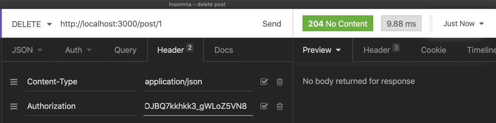

**[Será validado que não é possível deletar um blogpost com outro usuário]**

Se não for o dono do blogpost o resultado retornado deverá ser conforme exibido abaixo, com um status http `401`:

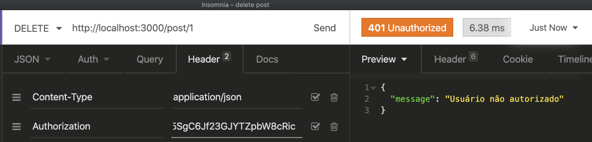

**[Será validado que não é possível deletar um blogpost inexistente]**

Se o blogpost nao existir o resultado retornado deverá ser conforme exibido abaixo, com um status http `404`:

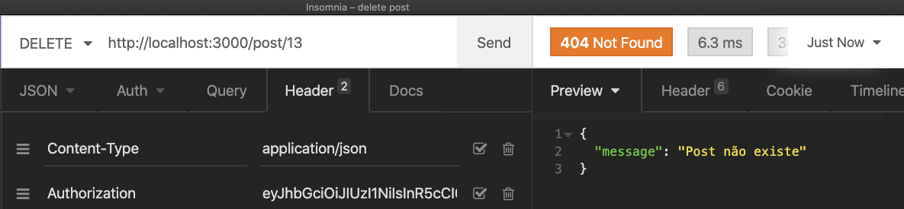

**[Será validado que não é possível deletar um blogpost sem o token]**

Se não contém o token o resultado retornado deverá ser conforme exibido abaixo, com um status http `401`:

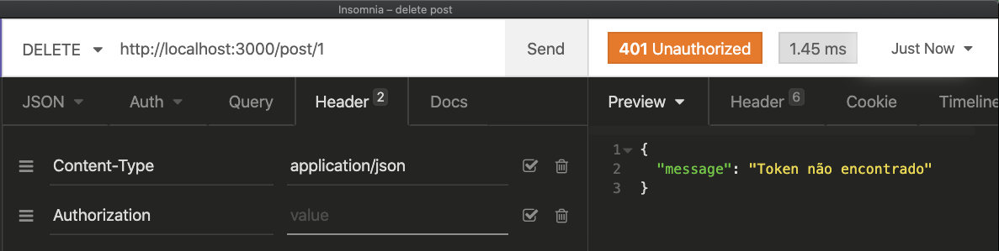

**[Será validado que não é possível deletar um blogpost com o token inválido]**

Se o token for inválido o resultado retornado deverá ser conforme exibido abaixo, com um status http `401`:

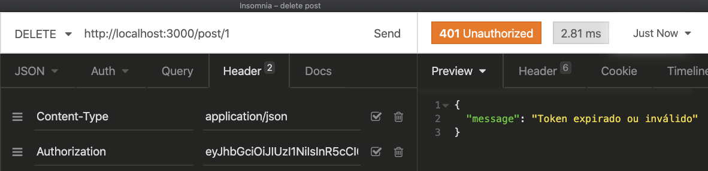


